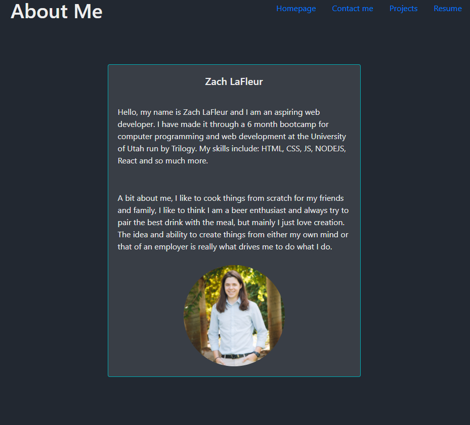

# React Portfolio 

### Project Link

This site is deploye [HERE](https://mrcartree.github.io/Portfolio-React/#/) on GitHub Pages.

### Description

This is my portfolio, completely created in React. you can navigate and click links, buttons, and images to take you to different places. It is entirely front end currently and I may implement a back end later dependant on what is needed.

### Screenshot

This project was authored by me [Zach LaFleur](https://github.com/MrCartree)